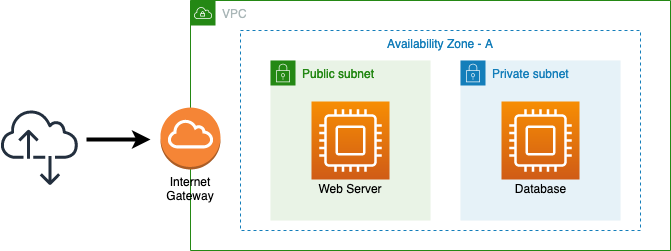
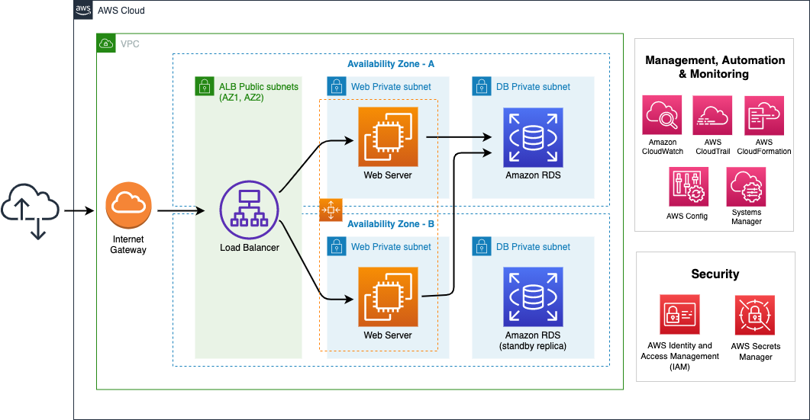

+++
title = "Introduction"
date = 2021-02-17T17:04:42-06:00
weight = 2
chapter = false
+++

In this workshop, you are going to learn about the **AWS Well-Architected Framework** focusing on a hands-on experience. The five labs in this Workshop are intended to guide you through the AWS Well-Architected pillars and help you understand how to improve an architecture using different strategies and AWS services.

These labs are designed *to be completed in sequence*, and the full set of instructions are documented below. Read and follow along to complete the labs. 

## The context

You work for **AnyCompany**, a retail business. One of the main apps for the company is a *product catalog;* a web application recently migrated to the AWS Cloud from the on-premises environment. Even though the application is functional, it is crucial to have an architecture with best practices applied, because the business is growing. As part of the Well-Architected practitioners team, you are looking for an architecture that meets the new performance requirements, mitigates risks, and saves money. Automation is also a fundamental part of the solution. 

The following is the initial architecture. Your mission is to improve upon it by applying some of the Well-Architected principles, according to the company’s needs.

## Architecture review

You proposed doing a Well-Architected Framework Review (WAFR) of the application’s environment to better understand the current status and the needs. After that review, you identified some insights, the most relevant of which are listed below:

1. Most of the operational tasks are performed manually. AnyCompany wants to automate the process to provide visibility into some important performance metrics, like memory or disk utilization. Additionally, a centralized log monitoring for DB and App is needed. 
2.	A highly available architecture is required for the product catalog application.
3.	Security is a top priority. The more insights available related to this topic, the better.
4.	They are not sure about the decision that they made when they chose a t2.micro instance to run the application. Performance is something that they do not want to sacrifice. AnyCompany people want to do some stress tests for the application, especially because they are expecting an increase in the demand on the application in the near future.
5.	Cost matters. Other teams at AnyCompany are testing other apps, and have had some users launch EC2 instances with optimized resources, when they are not needed. This situation has increased the monthly bill. Therefore, some controls should be implemented in order to avoid this issue in the future. 

The information above is your starting point to help enhancing the architecture and achieving organization objectives. You may identify more opportunities for improvement in this architecture but, for the purposes of the workshop, just focus on these findings.

## Target Architecture

After a Well-Architected Framework Review (WAFR), a target architecture has been defined. This architecture will help AnyCompany to achieve their initial objectives. You are going to utilize the five Well-Architected pillars to implement the following architecture:

## Labs:

This workshop is made up of five labs which align with each of the following five pillars of the [Well-Architected Framework](https://aws.amazon.com/well-architected):

-   [Operational Excellence](https://main.d2azidedm760yt.amplifyapp.com/work2/)
-   [Reliability](https://main.d2azidedm760yt.amplifyapp.com/work3/)
-   [Security](https://main.d2azidedm760yt.amplifyapp.com/work4/)
-   [Performance Efficiency](https://main.d2azidedm760yt.amplifyapp.com/work5/)
-   [Cost Optimization](https://main.d2azidedm760yt.amplifyapp.com/work6/)

	

