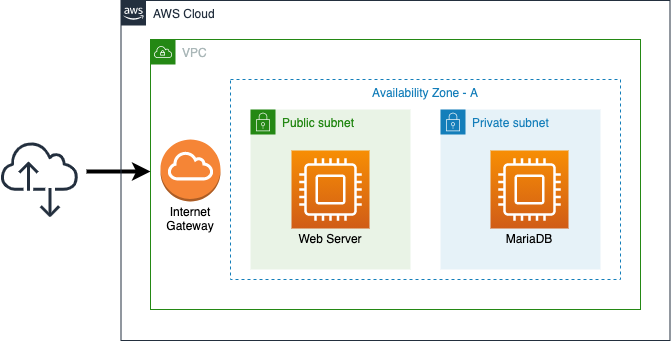
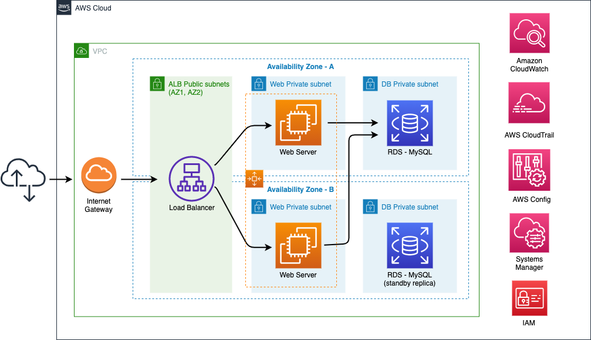

+++
title = "Introduction"
date = 2021-02-17T17:04:42-06:00
weight = 2
chapter = false
+++

In this workshop, you are going to learn about the **AWS Well-Architected Framework** focusing on a hands-on experience. The five labs in this Workshop are intended to guide you through the AWS Well-Architected pillars and how to improve an architecture using different strategies and AWS services.

These labs are designed *to be completed in sequence*, and the full set of instructions are documented below. Read and follow along to complete the labs. 

## The context

You work for an AWS Partner. Now you have a new customer, **The New Company**, a retail business. One of the main Apps for The New company is a *product catalog*, a web application that they recently migrated to the AWS Cloud from their On-prem environment. Even though the Application is functional, The New Company people want to have an architecture with best practices applied because the business is growing.  They are looking for an architecture that meet the new performance requirements, mitigate risks and save money. For them is crucial to use automation. 

The following is the initial architecture that you have found. Your mission is to improve it applying some of the Well-Architected principles according to the company needs. 

## Architecture review

You proposed to the customer a Well-Architected Framework Review (WAFR) to understand better the current status and their needs. After that review, you identified the some insights, here the most relevant:

1. They are doing a lot of operational tasks manually. The customer wants to automate the process to have visibility about some important performance metrics, like memory or disk utilization.

1. It is clear for the customer that they need to have a High Available architecture. 

1. Security is their number 1 priority. The more insights they can have available related to this topic, the better.

1. They are not sure about the decision that they made when they chose a t2.micro instance to run the application. Performance is something that they do not want to sacrifice. The New Company people want to do some stress tests for the application, especially because they are expecting an increase in the demand application in the near future.

1. How much they pay definitely matters. The customer is testing other Apps, but some users have launched EC2 instances with optimized resources, when they are not needed. This situation has increased the monthly bill. The New Company people wants to control this situation. 

The information above is your starting point to help this customer to enhance the architecture and to achieve their objectives. Take into account that you can identify more opportunities for improvement in this architecture, but for the Workshop's purpose we are going to focus on these findings. 

## Target Architecture

After a Well-Architected Framework Review (WAFR), you and The New Company have been defined a Target Architecture. This architecture will help the customer to achieve their initial objectives. You are going to pass through the five Well-Architected pillars to implement the following architecture:

## Labs:

This Workshop is made up of five Labs structured around the five pillars of the [Well-Architected Framework](https://aws.amazon.com/well-architected):

-   [Operational Excellence](https://main.d2azidedm760yt.amplifyapp.com/work2/)
-   [Reliability](https://main.d2azidedm760yt.amplifyapp.com/work3/)
-   [Security](https://main.d2azidedm760yt.amplifyapp.com/work4/)
-   [Performance Efficiency](https://main.d2azidedm760yt.amplifyapp.com/work5/)
-   [Cost Optimization](https://main.d2azidedm760yt.amplifyapp.com/work6/)

	

