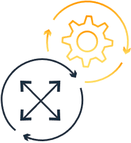
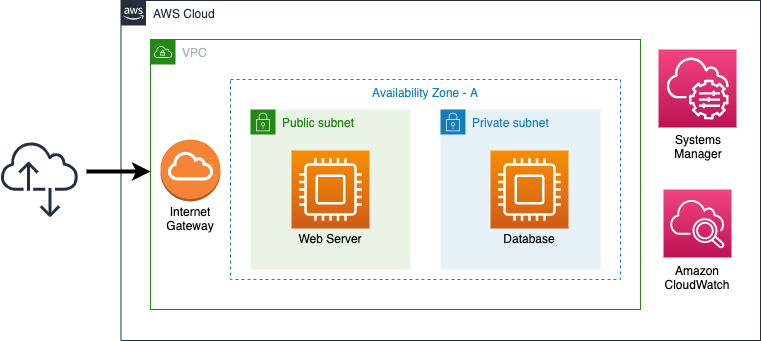

+++
title = "Operational Excellence"
date = 2021-02-17T17:04:42-06:00
weight = 4
chapter = false
pre = "<b>Lab 1:  </b>"
+++

The Operational Excellence pillar includes the ability to support development and run workloads effectively, gain insight into their operations, and to continuously improve supporting processes and procedures to deliver business value. 

{}
Remember that one of the insights found in the Well-Architected Framework Review (WAFR) was about the need to automate tasks. The New Company people are performing a lot of operational tasks manually. One of the issues they mentioned was a lack of visibility into important metrics like memory and disk utilization for the Amazon EC2 instances. They would like an automated process to get that information. Additionally, they need a centralized log monitoring for the DB and App instances. 
{}

## Objective

In this Lab, you will use AWS Systems Manager according to the **“Perform operations as code”** design principle. You will create a Resource Group with both Amazon EC2 instances and use the “Run command” option in SSM to install the Amazon CloudWatch agent for collecting logs and getting some additional metrics. The tasks in this Lab will guide you through the steps to achieve this objective.

## Services

Amazon EC2, AWS Systems Manager, Amazon CloudWatch

## Prerequisites

You will run this Lab at an AWS sponsored workshop then you will be provided with an AWS Account to perform all the tasks in the following section.

## Tasks

1. [Checking the existing architecture](https://main.d2azidedm760yt.amplifyapp.com/work2/task-1/)
1. [Tagging the Amazon EC2 instances](https://main.d2azidedm760yt.amplifyapp.com/work2/task-2/)
1. [Creating a Resource Group](https://main.d2azidedm760yt.amplifyapp.com/work2/task-3/)
1. [Enabling SSM for Amazon EC2 instances](https://main.d2azidedm760yt.amplifyapp.com/work2/task-4/)
1. [Installing Amazon CloudWatch agent with SSM](http://localhost:8080/work2/task-5/)
1. [Starting Amazon CloudWatch Agent](https://main.d2azidedm760yt.amplifyapp.com/work2/task-6/)
1. [Validating custom metrics and log groups](https://main.d2azidedm760yt.amplifyapp.com/work2/task-7/)

## Architecture

After completing tasks above, you will have the following architecture. 

