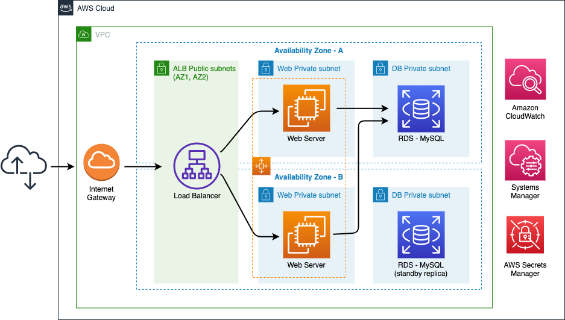

+++
title = "Reliability"
date = 2021-02-17T17:04:42-06:00
weight = 5
chapter = false
pre = "<b>Lab 2:  </b>"
+++

The reliability pillar encompasses the ability of a workload to perform its intended function correctly and consistently when it’s expected to. This includes the ability to operate and test the workload through its total lifecycle. 

{}
During the Well-Architected Framework Review (WAFR) you explained to **The New Company** about how important is to build a resilent solution as required to protect against failure. The customer understood the risks and business impact in case of failure. They trust your criteria as an APN Partner to recommend them the best resilient architecture. 
{}

## Objective

This hands-on lab will guide you through the steps to improve reliability of a service by using automation to deploy a reliable cloud infrastructure. You will create additional subnets in a second Availability Zone, an ELB and an Auto Scaling group for the Web Application, applying the **Scale horizontally to increase aggregate workload availability** desing principle from the Well-Architected Framework. You will also migrate the database to RDS enabling multi-AZ. When your architecture is ready you will test it to ensure your implementation is resilient to failure, **Testing recovery procedures**.

## Services

Amazon EC2, Amazon RDS (Multi-AZ), ELB, EC2 Auto Scaling Groups, AWS Secrets Manager

## Prerequisites

You will run this Lab at an AWS sponsored workshop then you will be provided with an AWS Account to perform all the tasks in the following section.

You will use Systems Manager in this Lab, therefore it is strongly recommended to run **Lab 1: Operational Excellence** in this workshop to perform this Lab. In case you cannot run all tasks in Lab 1, ensure to run *Task 4: Enabling SSM for EC2 instances*.

## Tasks

1. Adding subnets to a second AZ
2. Adding RDS subnets to both AZs
3. Updating SSM Parameter Store database
4. Creating an Application Load Balancer and a Target Group
5. Database migration with SSM Run Command
6. Creating Launch Template
7. Create Auto Scaling Group
8. Creating Route 53 health check
9. Nuking the web-app

## Architecture

The architecture of the infrastructure you will deploy is represented by this diagram:

