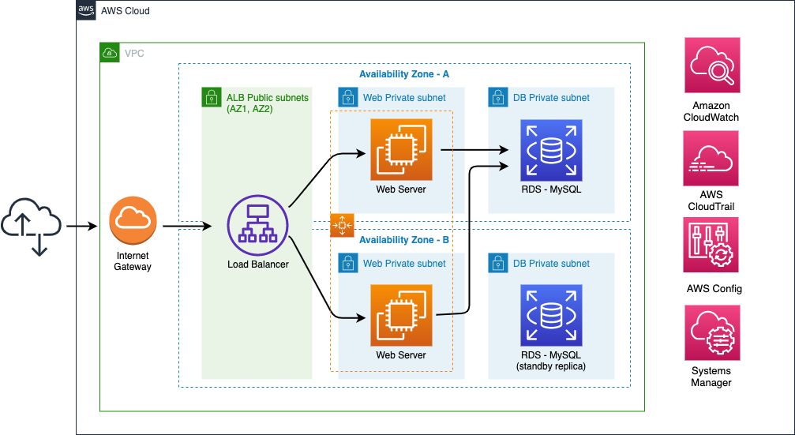

+++
title = "Security"
date = 2021-02-17T17:04:42-06:00
weight = 6
chapter = false
pre = "<b>Lab 3:  </b>"
+++

The Security pillar encompasses the ability to protect data, systems, and assets to take advantage of cloud technologies to improve your security.

{}
Security is our top priority and is also for The New Company customer . According to the Well-Architected Framework Review (WAFR), you as an AWS Partner recommend to implement some cloud native controls to prevent and detect security issues.
{}

## Objective

In this hands-on activity, you will identify which cloud-native solutions can mitigate the risks while providing scalability, reliability, and cost optimization at a low operational burden. During this Lab, mainly you will apply the **Enable traceability** design principle, learning how to use cloud native controls like AWS CloudTrail, Security Groups, Amazon  GuardDuty and AWS Systems Manager, to secure the cloud architecture.

## Services

AWS CloudTrail, AWS Config, Amazon GuardDuty, Amazon VPC, AWS Systems Manager.

## Prerequisites

You will run this Lab at an AWS sponsored workshop, and you will be provided with an AWS Account to perform all the tasks in the following section.

It is strongly recommended to run **Lab 1: Operational Excellence** and **Lab 2: Reliability** in this workshop to perform this Lab. In case you cannot complete Lab 2 before performing this Lab, you could execute the activities, however you will see a different configuration in your console compared to the one in the instructions.

## Tasks

1.	[Enable granular logging](https://main.d2azidedm760yt.amplifyapp.com/work4/task-1/)
1.	[Improve granular control of communication](https://main.d2azidedm760yt.amplifyapp.com/work4/task-2/)
1.	[Improve granular network-based controls](https://main.d2azidedm760yt.amplifyapp.com/work4/task-3/)
1.	[Evaluate detailed logging capabilities](https://main.d2azidedm760yt.amplifyapp.com/work4/task-4/)
1.	[Evaluate network-based protections](https://main.d2azidedm760yt.amplifyapp.com/work4/task-5/)
1.	[Minimize admin access risk](https://main.d2azidedm760yt.amplifyapp.com/work4/task-6/)

## Architecture

After completing tasks above, you will have the following architecture.

