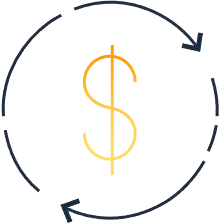
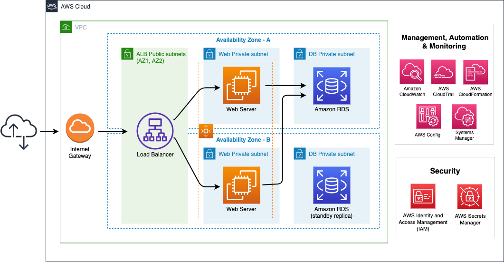

+++
title = "Cost Optimization"
date = 2021-02-17T17:04:42-06:00
weight = 8
chapter = false
pre = "<b>Lab 5:  </b>"
+++

The Cost Optimization pillar includes the ability to run systems to deliver business value at the lowest price point.

{}
**The New Company** would like to have a clear visibility about costs and usage for the AWS Services. They would like to use a flexible tool for creating their own dasboards according to their needs. They understand that they need a new way of analyzing expenditures to make informed decisions about cost tradeoffs.
{}

## Objective

This lab will guide you through the steps to visualize the cost and usage of AWS services in an account using Amazon QuickSight. This kind of implementation will provide cost and usage awareness throughout the organization, which is a fundamental practice according to the **Cloud Financial Management** design principle.

You will use a Cost and Usage Report (CUR) already prepared for you as part of this lab environment and you will use QuickSight to create visuals that will help you create costs analysis.

## Services

Amazon QuickSight

## Prerequisites

You will run this Lab at an AWS sponsored workshop then you will be provided with an AWS Account to perform all the tasks in the following section. You do not need to run previous Labs to complete tasks in this Lab. 

## Duration

Estimated time to complete: 40 min

## Tasks

0. [Cost & Usage Report Configuration](https://main.d2azidedm760yt.amplifyapp.com/work6/task-0/)

1. [Enable Amazon QuickSight](https://main.d2azidedm760yt.amplifyapp.com/work6/task-1/)

2. [Adding a data source in Amazon QuickSight](https://main.d2azidedm760yt.amplifyapp.com/work6/task-2/)

3. [Creating visuals in Amazon QuickSight](https://main.d2azidedm760yt.amplifyapp.com/work6/task-3/)

## Architecture

After completing tasks above, you will have the following architecture. 

{}
Reference: https://docs.aws.amazon.com/cur/latest/userguide/data-dictionary.html
https://pages.awscloud.com/rs/112-TZM-766/images/2019_0906-ENT_Examples.pdf
{}

